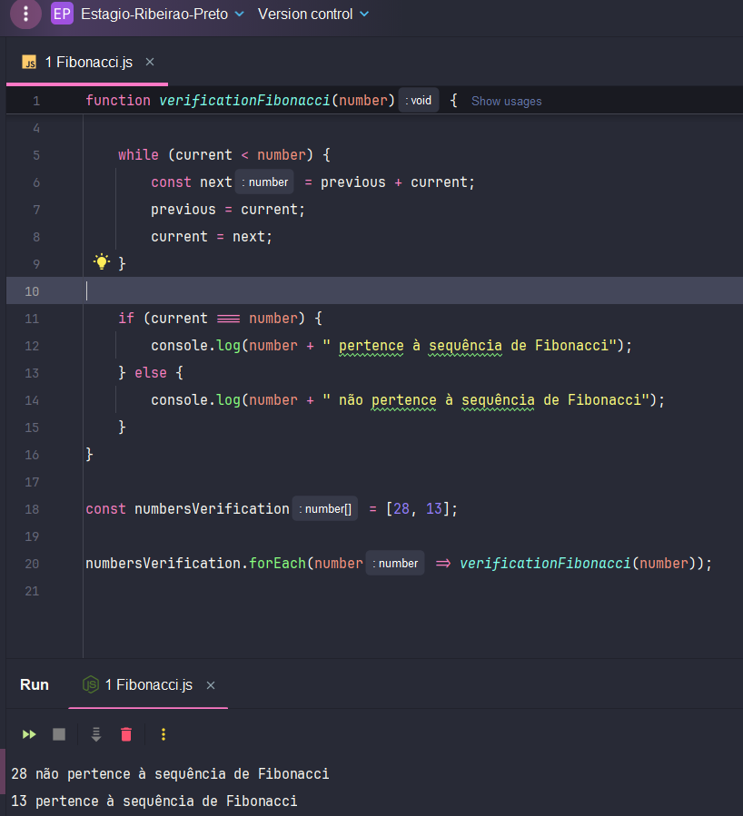
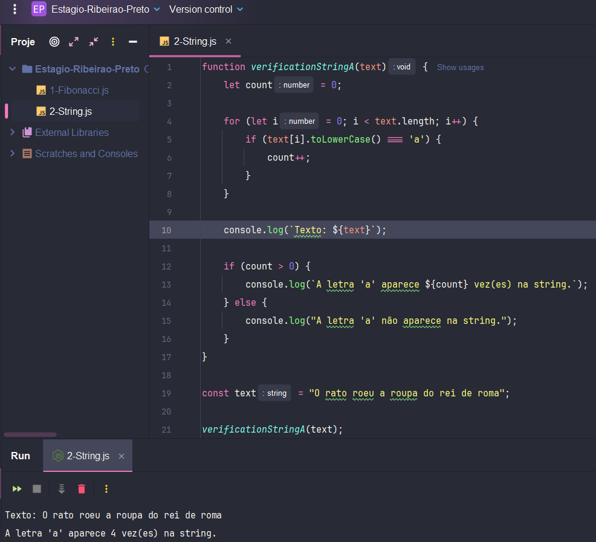

Teste Técnico 🔧⚙️

Este repositório contém soluções do o teste técnico para o Estágio em Desenvolvimento Ribeirão Preto 2024.

Questões & Soluções 👨🏻‍💻✅ 🔢🔣

1- Sequência de Fibonacci: Um programa que calcula a sequência de Fibonacci e verifica se um número pertence a essa sequência.

2- Verificando quantas vezes a letra "A" é repetida em uma string.

3- Calculando Soma de Números: Uma questão simples que envolve a soma de números em um loop.

4- Descobrindo a lógica de sequências numéricas

Aqui segue a lógica de adcionar +2 a cada próximo número.
a) 1, 3, 5, 7, 9

Nesta segue a lógica de multiplicar ele mesmo por 2.
b) 2, 4, 8, 16, 32, 64, 128

Aqui é o resultado dos números de 0 a 7 elevados ao quadrado.
c) 0, 1, 4, 9, 16, 25, 36, 49

Aqui segue a mesma lógica, porém, de números pares em forma crescente elevados ao quadrado de 2 a 10.
d) 4, 16, 36, 64, 100

Segue a sequência de Fibonacci, onde o próximo valor sempre será a soma dos dois anteriores.
e) 1, 1, 2, 3, 5, 8, 13

Segui a lógica dos últimos quatro números, onde iria incremetando +1.
f) 2,10, 12, 16, 17, 18, 19, 20

5- Lógica dos Interruptores

Primeiro ligaria o primeiro interruptor por um determinado tempo, o suficiente para aquecer a lâmpada.

Depois eu desligaria o primeiro e ligaria o segundo.

Ao checar, a lâmpada acesa é aquela que está sendo controlada pelo interruptor 2.
A lâmpada quente é a controlada pelo 1.
A lâmpada fria é a controlada pelo 3.